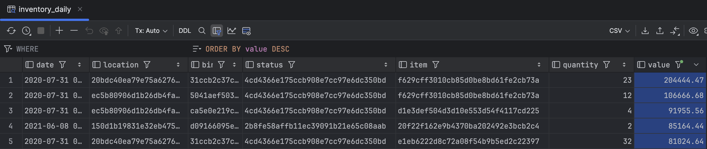
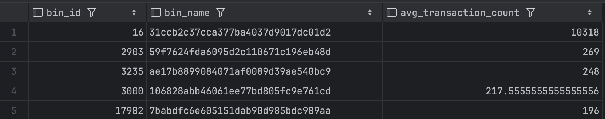
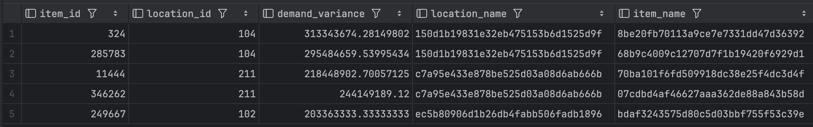

# Anduril Take Home Assignment

# Assignment 

## 1. Populating the Database

* Using dbt's seed functionality, we can populate the database with the data in the `seeds` folder.

* After unzipping the CSVs and placing them in the `seeds` folder, we can run the following command to populate the database:

    ```
    dbt seed
    ```

* I chose to specify the column types in dbt_project.yml to ensure that the data types are correct and to catch any obvious data type errors early

At this point our database looks like this:


## 2. Creating 'Inventory Daily' Table

* The first step was creating base models for each of the tables, where I did a little pre-processing to account for type errors I found at load time and I renamed columns where necessary in order to write more readable queries.

* I updated my project yml file to include these base models, as well as directories for processing and final models

* I created a model that creates the inventory_daily table using the following SQL query:

    ```
    WITH enriched_data AS (
        SELECT
            tlb.transaction_date AS date,
            l.location,
            b.bin,
            s.status,
            i.item,
            tlb.quantity,
            c.cost,
            (tlb.quantity * c.cost) AS value,
            ROW_NUMBER() OVER (
                PARTITION BY tlb.item_id, tlb.location_id, tlb.transaction_date
                ORDER BY c.effective_date DESC
            ) AS rank
        FROM {{ ref('transaction_line_base') }} tlb
        LEFT JOIN {{ ref('item_base') }} i ON tlb.item_id = i.item_id
        LEFT JOIN {{ ref('location_base') }} l ON tlb.location_id = l.location_id
        LEFT JOIN {{ ref('bin_base') }} b ON tlb.bin_id = b.bin_id
        LEFT JOIN {{ ref('inventory_status_base') }} s ON tlb.inventory_status_id = s.inventory_status_id
        LEFT JOIN {{ ref('costs_base') }} c
            ON tlb.item_id = c.item_id
            AND tlb.location_id = c.location_id
            AND c.effective_date <= tlb.transaction_date
    )
    SELECT
        date,
        location,
        bin,
        status,
        item,
        SUM(quantity) AS quantity,
        SUM(value) AS value
    FROM enriched_data
    WHERE rank = 1  -- Keep only the closest effective_date
    GROUP BY date, location, bin, status, item;
    ```

* After running `dbt run`, the inventory_daily table was created and looks as follows:



After this table is built though, it is clear there is at least one data issue. Starting with the fact that 67 rows do not have a a valid cost attached to them. This occurs because there is not a row in the cost table for that location and item that was creating prior to the transaction date. Some of these issues would be resolved if we use the closest date after was used retroactively, but still there are over 40 combinations of location, bin, transaction date, and inventory status that have no costs associated with them.

## 3. Data Quality Check

1. The first data quality concern I had was caught using the seed table creation. I initialized the quantity column in the *transaction_line* table as an integer, assuming orders came in discrete quantities. After loading the data I found 26 instances where quantity was not an integer. This could have been due to a variety of reasons, such as a mis-entered value or a partial order, so I made the quantity column a float to account for the reasonable possibility of partial orders. 

It is equally plausible that this is a data error though, so in the transaction_line_base model I added a column `is_non_integer` to flag these rows for further investigation and so stakeholders are able to make the decision to include or exclude these rows from analysis.

2. A minor detail I noticed was in the seed CSVs the date column for the cost column is "date" whereas in the documentation it is "effective_date". I updated the costs table in the base_model to reflect this.

3. As mentioned above, we have 44 groupings of location, bin, transaction_date, and inventory status that do not have a cost associated with them. This materielized view can be used to identify these rows and investigate the cause of the missing costs.

    ```
    CREATE MATERIALIZED VIEW missing_costs AS
    SELECT DISTINCT  
        tlb.location_id, 
        tlb.bin_id, 
        tlb.transaction_date, 
        tlb.inventory_status_id
    FROM 
        transaction_line_base tlb
    LEFT JOIN 
        costs_base c
        ON tlb.item_id = c.item_id
        AND tlb.location_id = c.location_id
        AND c.effective_date <= tlb.transaction_date
    WHERE 
        c.cost IS NULL;
    ```

4. Checking for duplicates:

    * When grouping the transaction_line table by transaction_id and transaction_line_id we have a number of duplicate rows. We have multiple cases where there are 337 rows with this grouping. Assuming each transactin_line represents a line item on an invoice or similar document it seems illogical that there would be multiple rows with the same transaction_id and transaction_line_id. This issue persists when adding more variables to the grouping, such as location_id, item_id, and bin_id. This could be a data entry error or a system error, but it is worth investigating further.

    * None of the dimension tables appear to have any duplicates.

5. Checking for nulls:

    There are no nulls in either the fact table or dimension tables.

6. Checking for data type errors:

    Using dbt's seed functionality we were able to constrain data types to the desired forms and catch any data type errors early.

7. Foreign Key integrity:

    Using LEFT JOIN we successfully populate bin, location, item, and status names in inventory_daily without null values.

8. Outliers:

    There seems to be quite a few outliers in the cost table. This is not neccessarily an error but worth pointing out. Many items have costs that over 100 standard deviations from their normal costs. This occurs in both directions where an expensive item will be listed for $0.50 or a cheaper item will see a sizable mark-up  The following query will provide outlier costs, some of which may be worth confirming by business stakeholders.

    ```
    WITH cost_statistics AS (
        SELECT
            item_id,
            AVG(cost) AS avg_cost,
            STDDEV(cost) AS stddev_cost
        FROM costs
        GROUP BY item_id, location_id
    ),
    cost_deviations AS (
        SELECT
            c.item_id,
            c.location_id,
            c.date,
            c.cost,
            cs.avg_cost,
            cs.stddev_cost,
            (c.cost - cs.avg_cost) / NULLIF(cs.stddev_cost, 0) AS num_sds
        FROM costs c
        JOIN cost_statistics cs
        ON c.item_id = cs.item_id
    ),
    outlier_costs AS (
        SELECT *
        FROM cost_deviations
        WHERE ABS(num_sds) > 5
    )
    SELECT *
    FROM outlier_costs
    ORDER BY ABS(num_sds) DESC;
    ```

## 4. Queries

Each query can be found in models/queries/

### a.

Given that there are no entries in transaction_line for item 355576 on on 2022-11-21, I will assume we can rely on the latest update for item 355576 to provide accurate information about the quantity and location/bin/status combos. In order to determine the inventory at each combination, we need to take all transaction line items pertaining to this item and find the most recent transaction date on or before 2022-11-21. This will give us the most recent snapshot of the inventory for each location/bin/status combo. Then we sum the quantities for each group to account for inflows and outflows of the product. This should give a snapshot of inventory statuses, and backorders, for item 355576 on 2022-11-21.

The following query provides the requested information on the most recent record on or before 2022-11-21 for item 355576:

    ```
    WITH relevant_transactions AS (
        SELECT
            t.transaction_line_id,
            t.location_id,
            t.bin_id,
            t.inventory_status_id,
            t.item_id,
            t.quantity,
            t.transaction_date
        FROM {{ ref('transaction_line_base') }} t
        WHERE t.item_id = 355576
        AND t.transaction_date <= '2022-11-21'
    ),
    aggregated_quantities AS (
        SELECT
            rt.location_id,
            rt.bin_id,
            rt.inventory_status_id,
            SUM(rt.quantity) AS total_quantity
        FROM relevant_transactions rt
        GROUP BY rt.location_id, rt.bin_id, rt.inventory_status_id
    )
    SELECT
        l.location AS location,
        b.bin AS bin,
        s.status AS status,
        aq.total_quantity
    FROM aggregated_quantities aq
    LEFT JOIN {{ ref('location_base') }} l ON aq.location_id = l.location_id
    LEFT JOIN {{ ref('bin_base') }} b ON aq.bin_id = b.bin_id
    LEFT JOIN {{ ref('inventory_status_base') }} s ON aq.inventory_status_id = s.inventory_status_id
    ```

This returns the following record:


### b. 

For query B, if we are looking to find the value of item 209372. In order to do this we need to track the inventory remaiing for each line item to see where we stand on inventory for this item. Once we know how much remaining inventory for each item we have we can collapse it into an overarching snapshot of the inventory (these steps could be condensed but it does make easier to see a more granular picture if done one step at a time). After we attach the current price this will give us the total value (cost * quantity) of the inventory for item 209372 on 2022-06-05.

    ```
    WITH filtered_costs AS (
        SELECT
            t.item_id,
            t.location_id,
            t.transaction_date,
            t.quantity,
            c.cost,
            c.effective_date,
            ROW_NUMBER() OVER (
                PARTITION BY t.item_id, t.location_id, t.transaction_date
                ORDER BY c.effective_date DESC
            ) AS rnk
        FROM {{ ref('transaction_line_base') }} t
        LEFT JOIN {{ ref('costs_base') }} c
        ON t.item_id = c.item_id
        AND t.location_id = c.location_id
        AND c.effective_date <= t.transaction_date
    ),
    valid_costs AS (
        SELECT
            item_id,
            location_id,
            transaction_date,
            quantity,
            cost,
            quantity * cost AS value
        FROM filtered_costs
        WHERE rnk = 1 and item_id = 209372 and transaction_date <= '2022-06-05'
    )
    SELECT SUM(value) AS total_value
    FROM valid_costs
    ```

This returns the following record:


### c. 

In order to find the value of inventory in the specified location we need to first take a snapshot of inventory on data 2022-01-01, so that means truncating data after that date and keeping the rows for each line item associated with that location. Taking the sum of quantity should give us the net quantity remaining using the transactions before 2022-01-01. Once we have the net quantity after summing the inflows and outflows we can attach the cost of each item on 2022-01-01 to determine the cost. Once we have the net quantity and cost for each item we can then sum to get the total value of the inventory. If we are only concerned with inventory on site then we can filter for negative quantities, which may represent back orders or other abnormalities.

    ```
    WITH collapsed_transactions AS (
        SELECT
            t.transaction_line_id,
            t.item_id,
            t.location_id,
            SUM(t.quantity) AS net_quantity,
            MAX(t.transaction_date) AS latest_transaction_date
        FROM {{ ref('transaction_line_base') }} t
        WHERE t.transaction_date <= '2022-01-01'
        GROUP BY
            t.transaction_line_id, t.item_id, t.location_id
    ),
    latest_costs AS (
        SELECT
            c.item_id,
            c.location_id,
            c.cost,
            ROW_NUMBER() OVER (
                PARTITION BY c.item_id, c.location_id
                ORDER BY c.effective_date DESC
            ) AS rnk
        FROM {{ ref('costs_base') }} c
        WHERE c.effective_date <= '2022-01-01'
    ),
    filtered_costs AS (
        SELECT
            item_id,
            location_id,
            cost
        FROM latest_costs
        WHERE rnk = 1
    ),
    joined_transactions AS (
        SELECT
            ct.transaction_line_id,
            l.location AS location_name,
            ct.item_id,
            ct.net_quantity,
            ct.latest_transaction_date,
            fc.cost,
            (ct.net_quantity * fc.cost) AS total_value
        FROM collapsed_transactions ct
        LEFT JOIN filtered_costs fc
        ON ct.item_id = fc.item_id
        AND ct.location_id = fc.location_id
        LEFT JOIN {{ ref('location_base') }} l
        ON ct.location_id = l.location_id
    ),
    location_filtered AS (
        SELECT
            transaction_line_id,
            item_id,
            net_quantity,
            cost,
            total_value
        FROM joined_transactions
        WHERE location_name = 'c7a95e433e878be525d03a08d6ab666b'
        AND net_quantity > 0 -- Exclude neg inventory
    )
    SELECT
        SUM(total_value) AS total_inventory_value
    FROM location_filtered
    ```

This returns the following record:


## 5. Other Insights

### Inventory Age

The `inventory_age.sql` model provides a look at length of time (in days) since an item in a certain location was last touched. This is useful for identifying items that have been sitting in a location for a long time and may need to be revisted. *This query could be optimized with documentation that denotes when an item has left the system*

The query is as follows:

    ```
        WITH latest_date_cte AS (
        SELECT
            MAX(t.transaction_date) AS latest_date
        FROM transaction_line t
    ),
    transaction_data AS (
        SELECT
            t.item_id,
            t.location_id,
            t.bin_id,
            MAX(t.transaction_date) AS last_transaction_date
        FROM transaction_line t
        GROUP BY t.item_id, t.location_id, t.bin_id
    ),
    aging_data AS (
        SELECT
            td.item_id,
            td.location_id,
            td.bin_id,
            ld.latest_date,
            DATE_PART('day', ld.latest_date - td.last_transaction_date) AS inventory_age
        FROM transaction_data td
        CROSS JOIN latest_date_cte ld
    )
    SELECT
        l.name AS location_name,
        b.name AS bin_name,
        i.name AS item_name,
        AVG(aging_data.inventory_age) AS average_inventory_age
    FROM aging_data
    LEFT JOIN location l ON aging_data.location_id = l.id
    LEFT JOIN bin b ON aging_data.bin_id = b.id
    LEFT JOIN item i ON aging_data.item_id = i.id
    GROUP BY l.name, b.name, i.name
    ```

### Bin Activity

When looking at the data it occurred to me that this data could be used to optimize bin sizes and labor allocation. In order to generate insight on this, I want to see how many transactions each bin has per day on average. Outliers may suggest a new bin is needed, even if it is operational, in order to break down where the most activity is occurring on a granular level. The following query provides this sort of information:

    ```
    WITH daily_bin_activity AS (
        SELECT
            DATE(t.transaction_date) AS activity_date,
            t.bin_id,
            b.name AS bin_name,
            COUNT(*) AS transaction_count
        FROM transaction_line t
        LEFT JOIN bin b ON t.bin_id = b.id
        GROUP BY DATE(t.transaction_date), t.bin_id, b.name
    ),
    most_active_bins AS (
        SELECT
            activity_date,
            bin_id,
            bin_name,
            transaction_count,
            RANK() OVER (PARTITION BY activity_date ORDER BY transaction_count DESC) AS rank
        FROM daily_bin_activity
    )
    SELECT
        bin_id,
        bin_name,
        AVG(transaction_count) as avg_transaction_count
    FROM most_active_bins
    WHERE rank = 1
    GROUP BY bin_id, bin_name
    ORDER BY avg_transaction_count DESC;
    ```

The result is interesting:



It is clear there is an outlier bin where the process would be worth inspecting.

### Variance in Inventory at Specific Locations

In handling seasonality in demand, it is important to understand sources of variance and identify them in order to optimize labor and other resources needed to handle surges while avoiding waste in lulls. The following code creates a table for every day in the time period we are studying in order to be able to track rolling inventory quantities over a 30 day period. Once we have this data, we can calculate which combinations of location_id and item_id vary the most in order to identify seasonal items that may need to be scrutinized more when doing resource planning. The following query identifies combinations if items and locations with the most variance in inventory quantity.  

    ```
    WITH date_series AS (
        SELECT
            d::date AS transaction_date
        FROM
            generate_series(
                (SELECT MIN(transaction_date) FROM transaction_line),
                (SELECT MAX(transaction_date) FROM transaction_line),
                '1 day'::interval
            ) d
    ),
    filled_data AS (
        SELECT
            ds.transaction_date,
            t.item_id,
            t.location_id,
            COALESCE(SUM(t.quantity), 0) AS daily_demand
        FROM date_series ds
        LEFT JOIN transaction_line t
            ON ds.transaction_date = DATE(t.transaction_date)
        GROUP BY ds.transaction_date, t.item_id, t.location_id
    ),
    rolling_demand AS (
        SELECT
            fd.item_id,
            fd.location_id,
            fd.transaction_date,
            SUM(fd.daily_demand) OVER (
                PARTITION BY fd.item_id, fd.location_id
                ORDER BY fd.transaction_date
                ROWS BETWEEN 29 PRECEDING AND CURRENT ROW
            ) AS rolling_30_day_demand
        FROM filled_data fd
    ),
    variance_calculation AS (
        SELECT
            item_id,
            location_id,
            VARIANCE(rolling_30_day_demand) AS demand_variance
        FROM rolling_demand
        GROUP BY item_id, location_id
    ),
    most_variable_demand AS (
        SELECT
            item_id,
            location_id,
            demand_variance
        FROM variance_calculation
        where demand_variance is not null
        ORDER BY demand_variance DESC
        LIMIT 5
    )
    SELECT
        mvd.item_id,
        mvd.location_id,
        mvd.demand_variance,
        l.name AS location_name,
        i.name AS item_name
    FROM most_variable_demand mvd
    LEFT JOIN location l ON mvd.location_id = l.id
    LEFT JOIN item i ON mvd.item_id = i.id;
    ```

The result is as follows:



# Wrap-Up

Thank you for the opportunity to work on this project. I have thoroughly enjoyed getting to know the team over this process and am eager to hear your feedback!

Thank you,
Max

# Sources

* https://docs.getdbt.com/

* Kimball's Data Warehouse Toolkit: Chapter 3, Inventory

* https://dba.stackexchange.com/questions/175963/how-do-i-generate-a-date-series-in-postgresql

* https://www.startdataengineering.com/post/dbt-data-build-tool-tutorial/


